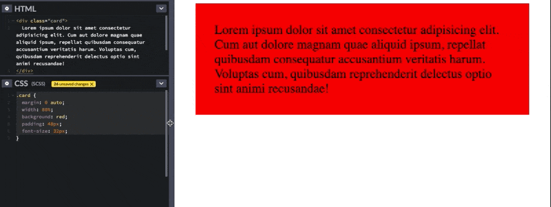
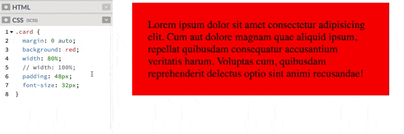
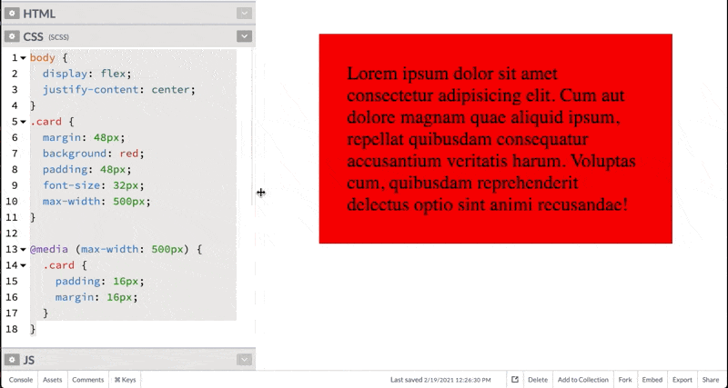

# Let's talk "Responsive"
I've ecountered a couple misconceptions lately about what it means to style and design "responsive" layouts, and I thought the clearest way to communicate this stuff would be to document it rather than just snipe at people in PR comments and instant messages.  So hereeee we goooo.

## Responsive?

## Percentages
You probably don't want to use percentages.

This is the basic thought process I've seen.
> I want this thing to respond to the width/height of the browser view port, so what I need here is to make the dimensions of my element a percentage of the viewport.

The truth: _most_ elements are already responsive to the viewport. Consider this code and the gif that follows.

```css
.card {
  margin: 0 auto;
  width: 80%;
  background: red;
  padding: 48px;
  font-size: 32px;
}
```


Obviously this _kind of_ works... but IMO it's probably not the best way to solve the problem. One issue here is that as the screensize changes, the amount of margin to either side of the card also changes, which leads to some less-than-aesthetically pleasing combinations. Generally, things look nice when the amount of margin outside of an element and the padding inside the element are either the same, or at least related. In this example however, the padding inside the card (between the words and the edge of the card) stays static while the margin changes. Also, the relationship between the side-margins and top margin changes as well.

### Solutions
If you simply remove the width rule, most block-level html elements will expand horizontally to fill 100% of the horizontal space. This behavior is _not_ the same as sticking `width: 100%` on it either.  Consider the following and notice the horizontal overflow.



#### OK BUT I DON"T WANT IT TO BE FULL WIDTH.

I know.... but rather than using a percentage to define the width of the element, use a static margin.  It'll still be responsive, but will look much nicer at most screen-sizes.  If you _want_ the thing to have a smaller margin so it will fit on smaller screens, that's a perfect time to use a breakpoint.

```css
.card {
  margin: 48px;
  background: red;
  padding: 48px;
  font-size: 32px;
}

@media (max-width: 500px) {
  .card {
    padding: 16px;
    margin: 16px;
  }
}
```


One more great addition here is a max-width, so that the element won't exceed a certain width even on extremely large screens. This is much more aesthetically pleasing and consistent than the percentages, or adding another breakpoint (`padding: 512px` LOL) for wide screens. If the element in question needs to be centered you can no longer rely on `margin: auto` to center it... but there are 85 ways to center things in JS.  I like flexbox: 

```css
body {
  display: flex;
  justify-content: center;
}
.card {
  margin: 48px;
  background: red;
  padding: 48px;
  font-size: 32px;
  max-width: 500px;
}

@media (max-width: 500px) {
  .card {
    padding: 16px;
    margin: 16px;
  }
}
```

