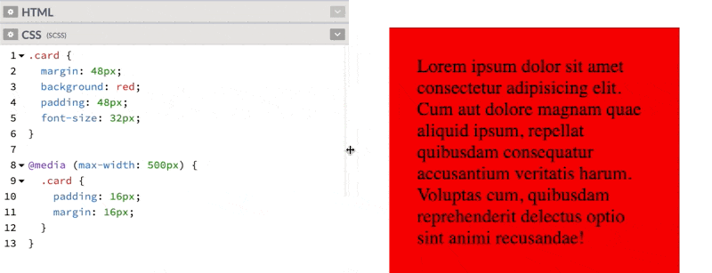

# Let's talk "Responsive"
I've ecountered a couple misconceptions lately about what it means to style and design "responsive" layouts, and I thought the clearest way to communicate this stuff would be to document it rather than just snipe at people in PR comments and instant messages.  So hereeee we goooo.

## Responsive?
OK when we say "responsive" what we mean is that the thing we're styling should look nice on the range of viewports and orientations that we support. In most cases that means things should look fine everything from ultrawide monitors to the smallest popular smartphones in use (the iphone 5 is probably the smallest phone that is still getting a fair amount of use.. it's viewport is 320px wide)

What we **do NOT** mean is that the views should look _identical_ on every screen size.  In fact that would actually be problematic in a few ways.  For example, the proportions of header/footer/content that looks nice on a phone are going to be quite different than what people expect to see on a normal desktop monitor. Text that is perfectly readable on a normal monitor, would have to be scaled down to fit within the same layout on a tiny screen, probably enough that it would be unreadable.

Generally it's intended that there will be some things that change between screensizes. Some text will overflow. Margins and paddings might need to be adjusted etc. This is all fine.

## Percentages
You probably don't want to use percentages.

This is the basic thought process I've seen.
> I want this thing to respond to the width/height of the browser view port, so what I need here is to make the dimensions of my element a percentage of the viewport.

The truth: _most_ elements are already responsive to the viewport. Consider this code and the gif that follows.

```css
.card {
  margin: 0 auto;
  width: 80%;
  background: red;
  padding: 48px;
  font-size: 32px;
}
```


Obviously this _kind of_ works... but IMO it's probably not the best way to solve the problem. One issue here is that as the screensize changes, the amount of margin to either side of the card also changes, which leads to some less-than-aesthetically pleasing combinations. Generally, things look nice when the amount of margin outside of an element and the padding inside the element are either the same, or at least related. In this example however, the padding inside the card (between the words and the edge of the card) stays static while the margin changes. Also, the relationship between the side-margins and top margin changes as well.

### Solutions
If you simply remove the width rule, most block-level html elements will expand horizontally to fill 100% of the horizontal space. This behavior is _not_ the same as sticking `width: 100%` on it either.  Consider the following and notice the horizontal overflow.


#### OK BUT I DON'T WANT IT TO BE FULL WIDTH.

I know.... but rather than using a percentage to define the width of the element, use a static margin.  It'll still be responsive, but will look much nicer at most screen-sizes.  If you _want_ the thing to have a smaller margin so it will fit on smaller screens, that's a perfect time to use a breakpoint.

```css
.card {
  margin: 48px;
  background: red;
  padding: 48px;
  font-size: 32px;
}

@media (max-width: 500px) {
  .card {
    padding: 16px;
    margin: 16px;
  }
}
```



One more great addition here is a max-width, so that the element won't exceed a certain width even on extremely large screens. This is much more aesthetically pleasing and consistent than the percentages, or adding another breakpoint (`padding: 512px` LOL) for wide screens. If the element in question needs to be centered you can no longer rely on `margin: auto` to center it... but there are 85 ways to center things in JS.  I like flexbox: 

```css
body {
  display: flex;
  justify-content: center;
}
.card {
  margin: 48px;
  background: red;
  padding: 48px;
  font-size: 32px;
  max-width: 500px;
}

@media (max-width: 500px) {
  .card {
    padding: 16px;
    margin: 16px;
  }
}
```


## Viewport Units

Viewport (`vh`/`vw`) units carry a lot of the same downsides as percentages. In fact, in many cases they behave pretty much the same. However, unfortunately, they come with an additional downside: Viewport units can be buggy on smartphones.  This is likely to improve a bit as phone technology improves, but the way that phone browsers (specifically iOS browsers) interpret the 'viewport' is not the way most people expect or desire.

The most significant issue is the toolbar at the bottom.


It appears and disappears as you scroll around and tap on the webpage/browser, and is _not_ taken into account when viewport units are calculated.

Probably the most common thing we're trying to do when using vh/vw is to create a webapp that behaves somewhat like a native app, is full-height in the browser with our own header and footer. This toolbar will cover up anything  you put on the bottom of the screen which can be a real problem.

Consider the following: 
```html
<div class="full-screen">
  <div class="header"></div>
  <div class="content">
    Lorem ipsum dolor sit amet, consectetur adipisicing elit. Eligendi, voluptatibus odio? Obcaecati neque nesciunt officiis nulla iusto veritatis, quas mollitia provident, ullam optio possimus ducimus perspiciatis magnam ab et excepturi.
  </div>
  <div class="footer"></div>
</div>
```
```css
* {box-sizing: border-box;}
body {margin: 0;}

.full-screen {
  background: pink;
  font-size: 32px;
  height: 100vh;
}

.content {
  padding: 16px;
  // header and footer are 50px each
  height: calc(100% - 100px);
}

.header {
  height: 50px;
  background: blue;
}

.footer {
  height: 50px;
  background: green;
}
```


In this example, which looks and works fine on most desktop browsers, (and android browsers too) the footer would likely spend a lot of time covered up by the iOS safari toolbar, which is no good if you are intending to put important information or buttons down there.

### Solutions

Unfortunately the solution here is less elegant than the 100vh, but it does have the advantage of _working as intended_. The solution is to use `position: fixed`. The screenshot from my browser would look the same here, so I'll just paste in the code that's been changed.  We're not done with this example yet either, so I'll wait to post the whole code until we're done.

```css
.full-screen {
  background: pink;
  font-size: 32px;
  position: fixed;
  top: 0;
  bottom: 0;
  left: 0;
  right: 0;
}
```

`position: fixed` with `top`, `left`, `right`, and `bottom` set to `0` is not _technically_ the same effect as `height: 100vh`, but if the desire is to create a full-screen app-like experience then it's closer to what you _actually_ want.

## Calc
OK listen.  Calc is awesome, and I'm not about to tell you to never use it.... but the example I've just shown you has another problem here:

```css
.content {
  padding: 16px;
  // header and footer are 50px each
  height: calc(100% - 100px);
}
```

This section is the middle of our full-screen view. The part with all the text. We set the height like this to push the footer to the bottom of the screen.  Without it, our app would look like this: 


However, doing this calculation requires that our header and footer _always_ add up to exactly 100px, which is kind of hard to guarantee. If we're creating a multi-use layout component that lets us stick in different header/footer combinations or if we are always using the same header, but sticking in different content (titles, subtitles, buttons, whatever) it can be hard to guarantee that nothing is ever going to overflow and expand the header. Sometimes the design just changes!

A better solution here is to use flexbox (with `flex-direction: column`) to make sure our design is.... _flexible_.


Flexbox roooooocks.

Here's the full code for this finished layout.

`html`
```html
<div class="full-screen">
  <div class="header"></div>
  <div class="content">
    Lorem ipsum dolor sit amet, consectetur adipisicing elit. Eligendi, voluptatibus odio? Obcaecati neque nesciunt officiis nulla iusto veritatis, quas mollitia provident, ullam optio possimus ducimus perspiciatis magnam ab et excepturi.
  </div>
  <div class="footer"></div>
</div>
```

`css`
```css
* {box-sizing: border-box;}
body {margin: 0;}

.full-screen {
  background: pink;
  font-size: 32px;
  position: fixed;
  top: 0;
  bottom: 0;
  left: 0;
  right: 0;
  display: flex;
  flex-direction: column;
}

.content {
  padding: 16px;
  flex-grow: 1;
}

.header {
  height: 50px;
  background: blue;
}

.footer {
  height: 50px;
  background: green;
}
```

And [here's a link to the codepen](https://codepen.io/codyloyd/pen/qBqXbLN?editors=1100)
